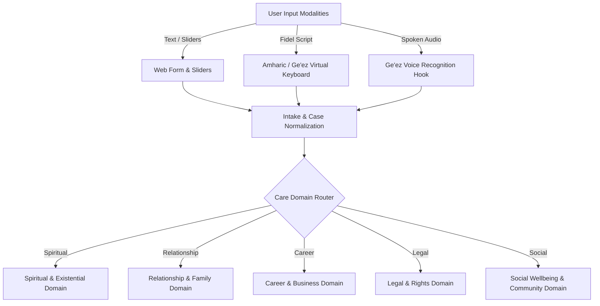
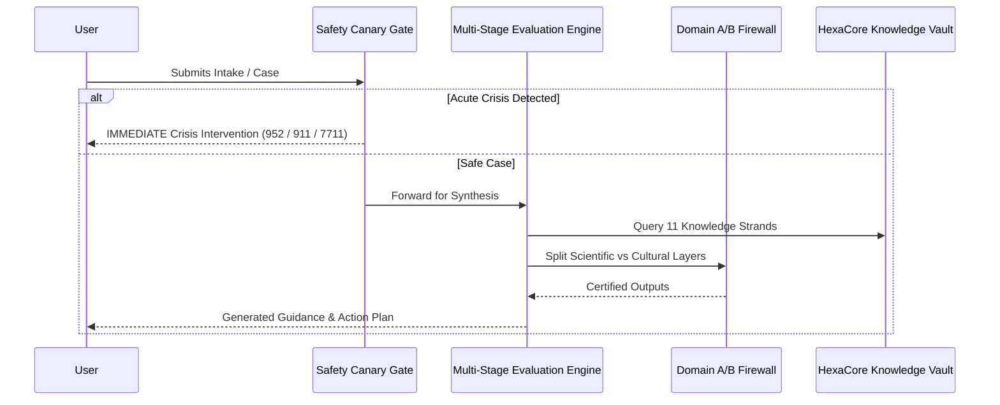
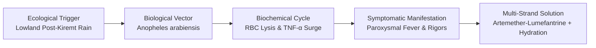
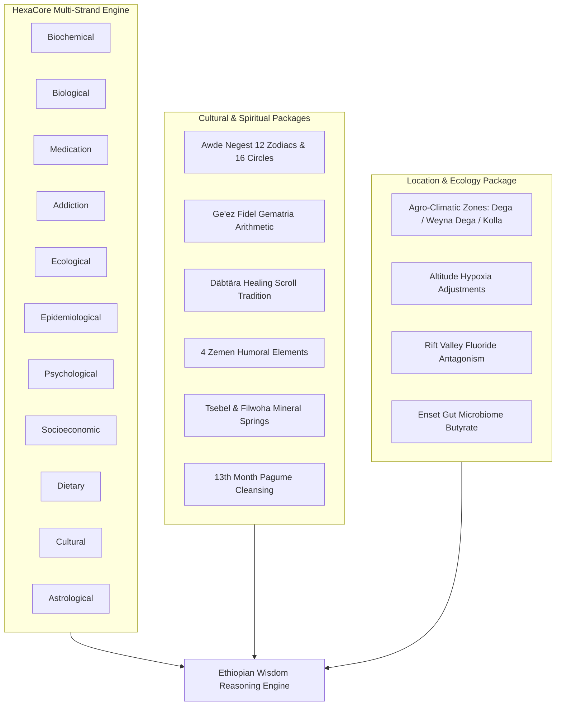
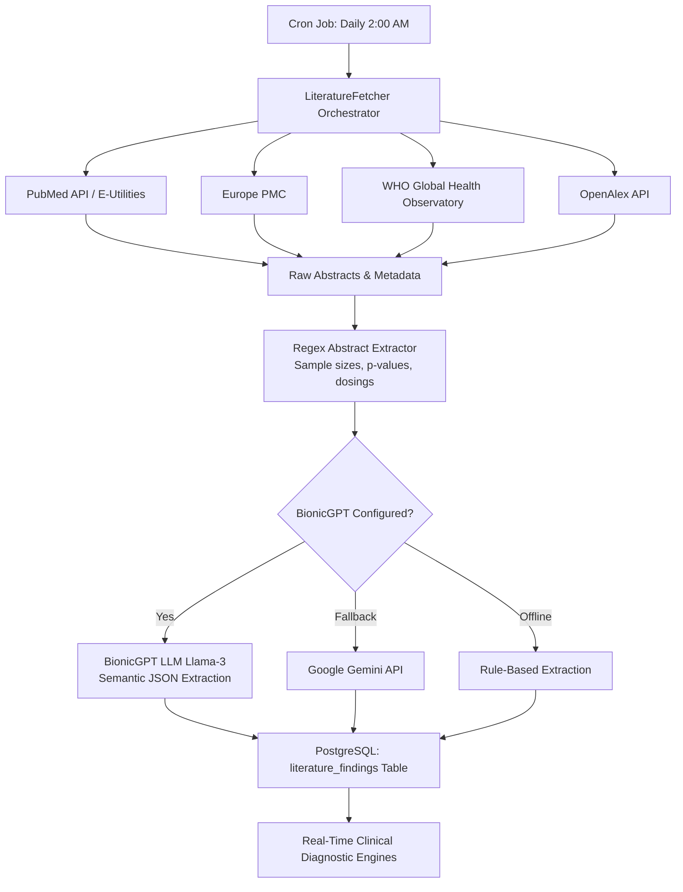
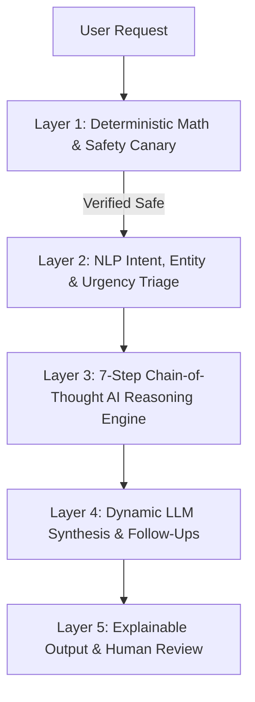

# Ethiopian Wisdom Platform: Architecture, Data Ingestion, Multi-Strand Reasoning & Continuous Intelligence Note

---

## Executive Summary

The **Ethiopian Wisdom Platform** is a hybrid enterprise system that harmonizes **indigenous Ethiopian cultural-spiritual heritage** (Awde Negest, Däbtära manuscript traditions, Ge'ez gematria letter arithmetic) with **evidence-based clinical, biochemical, nutritional, and ecological science**. 

The system is governed by a strict **Architectural Firewall** separating **Domain A (Scientific & Evidence-Based Care)** from **Domain B (Cultural, Astrological & Spiritual Reflection)**, ensuring that cultural practices enrich reflection without compromising life-safety, clinical contraindications, or emergency triage.

---

## 1. How Users Insert Data & Cases

### 1.1 Input Channels & Multimodal Interfaces
1. **Interactive Multilingual Intake**:
   - Accepts inputs in **Amharic (አማርኛ)**, **Afaan Oromoo**, **Tigrinya (ትግርኛ)**, **Somali**, and **English**.
   - Collects core demographics: chronological age, birth date, baptismal name (የክርስትና ስም), mother's name, gender, region, and city.
2. **Ge'ez Virtual Keyboard (`AmharicKeyboardModal.tsx`)**:
   - Provides on-screen soft-keyboard support for the 33 base Fidel families (ሀ to ፐ) and orders (ግዕዝ to ሳብዕ).
   - Context-aware preset banks:
     - `PRESETS_GENERAL`: Traditional spiritual and family names.
     - `PRESETS_CAREER`: Prominent commercial and leadership names (ሰሎሞን, ማርያም, ሄለን, ዳዊት, ሰናይት, ሚካኤል, ሃብታሙ, ብርቱካን, አምሃ, ዘሪቱ).
3. **Voice / Speech Recognition (`useGeezVoiceInput.ts`)**:
   - Speech-to-text recognition supporting Ethiopian phonetic nuances and vernacular phrasing with live waveform audio feedback.
4. **Vitals & Cultural Habit Logging**:
   - **Altitude & Geography**: Elevation in meters (e.g. Addis Ababa 2,400m, Gondar 2,133m, Dire Dawa 1,276m, Semera 433m).
   - **Orthodox Christian Tsom (ጾም) Calendar**: Fasting schedules (Wednesdays/Fridays, Hudadi/Lent, Tsome Nebiyat/Advent) eliminating animal proteins for 180–250 days annually.
   - **Culinary Preparation Details**: Fermentation duration of teff ersho (እርሾ) batter (1 to 4 days), consumption of raw bovine meat (Kitfo, Gored Gored), and daily coffee ceremony ritual frequency.
   - **Medical & Pharmacological Profile**: Active prescription medications (Warfarin, Metformin, Antihypertensives), allergies, and surgical history.

### 1.2 Case Taxonomy (5 Specialized Domains)
Users submit cases into one of five structured domains:
1. **Spiritual & Existential (`spiritual`)**: Soul unrest, baptismal lineage, ancestral prayer cycles, spiritual fasting, and traditional healing scroll inquiries.
2. **Relationship & Family (`relationship`)**: Marital alignment, parental guidance, domestic harmony, and compatibility.
3. **Career & Business (`career`)**: Vocational transitions, cooperative finance (Equb/Iddir), enterprise launch timing, and leadership resilience.
4. **Legal & Civil Rights (`legal`)**: Land inheritance, tenancy, workplace disputes, community mediation (Shimgelina), and emergency safety.
5. **Social Wellbeing & Community (`social`)**: Diaspora reintegration, migration stress, generational bridge-building, and grief support.

---

## 2. Information Processing & Multi-Stage Evaluation Pipeline

### Stage 1: Profile Normalization & Demographic Calibration
- Normalizes free-text answers into standardized ontologies.
- Associates user location with authoritative agro-climatic altitude and temperature models.

### Stage 2: Baseline Calibration & Altitude Adaptation
- Adjusts micronutrient requirements:
  - Atmospheric hypoxia in highland plateaus (>2,400m) increases renal erythropoietin secretion, raising basal elemental iron requirements by 25–40% compared to sea-level baselines.

### Stage 3: Fermentation Kinetics & Bioavailability Modeling
- Evaluates phytic acid and tannin chelation curves:
  - 4-day ersho (sourdough) lactic acid and yeast fermentation degrades teff phytic acid by up to 72%, freeing bound iron, zinc, and calcium.
  - Conversely, short-fermented teff (<24 hours) or unfermented flatbreads pose severe micronutrient bioavailability blocks.

### Stage 4: Mandatory Safety Screening & Emergency Canary Firewalls
- **Immediate Life-Safety Interception**:
  - Evaluates inputs for suicide ideation, self-harm, severe domestic violence, psychosis, or acute red-flag symptoms (dyspnea, anaphylaxis, severe chest pain).
  - Immediately routes to emergency services:
    - **Ethiopian National Mental Health Hotline**: `952`
    - **National Emergency Response Line**: `911`
    - **National Domestic Violence Support Hotline**: `7711`
  - **Zero-Paywall Guarantee**: All safety screenings and crisis pathways are completely free and never gated behind paywalls or logins.

### Stage 5: Domain A / Domain B Architectural Firewall
- **Domain A (Scientific Care)**:
  - Governed by peer-reviewed literature, pharmacokinetic databases, and evidence thresholds.
  - Calculates nutritional gaps, drug interactions, and clinical triage.
- **Domain B (Cultural, Astrological & Spiritual Reflection)**:
  - Awde Negest 12 zodiac signs, 16 magic circles, Fidel gematria calculations, and talismanic characters.
- **Firewall Invariant**: Domain B variables are strictly isolated in memory and database schema. They can never alter Domain A clinical risk scores, drug contraindication gates, or emergency triage.

---

## 3. Causal Identification & Attribution Engine

### 3.1 Directed Acyclic Causal Graph Construction (`causalInference.ts`)
The Causal Inference Engine constructs multi-node directed graphs linking root environmental, dietary, and pharmacological causes to biological endpoints:
1. **Ecological Node**: Altitude hypoxia, ambient humidity, vector breeding ecology, geothermal groundwater fluoride.
2. **Dietary & Lifestyle Node**: Fasting-induced animal protein omission, meal-adjacent coffee tannin chelation, raw meat ingestion.
3. **Biochemical Node**: Ferritin depletion, duodenal ferroportin blocking, B12 deficiency, homocysteine elevation.
4. **Symptom Node**: Microcytic anemia, chronic exhaustion, brain fog, dyspepsia.
5. **Remediation Node**: Fermentation optimization, timing adjustments, botanical synergy, medical referral.

### 3.2 Key Modeled Causal Mechanisms
- **Highland Hypoxia + Coffee Polyphenol Chelation**:
  Drinking Ethiopian coffee immediately with or after meals introduces chlorogenic acids and condensed tannins that chelate non-heme iron into insoluble complexes in the duodenum, preventing absorption and triggering chronic lethargy.
- **Medication-Induced Nutrient Depletion**:
  Chronic Metformin usage impairing ileal calcium-dependent absorption of Vitamin B12; Diuretic-induced potassium and magnesium wasting.
- **Dietary Antinutrients**:
  Phytates in unfermented grains chelating zinc and magnesium; high oxalates in unboiled wild greens binding calcium.
- **Lowland Vector-Safe Iron Gating**:
  Administering oral iron during active, asymptomatic *Plasmodium falciparum* parasitemia in warm lowlands promotes rapid parasite multiplication. The engine flags this interaction and gates iron therapy until malaria negativity is confirmed.

---

## 4. Proposing Solutions, Refinement & Communication

### 4.1 Proposing Integrated Solutions
Solutions combine four complementary tiers:
1. **Dietary Restitution**:
   - Spacing the Ethiopian coffee ceremony 60–90 minutes away from iron-rich meals.
   - Extending teff fermentation to 72–96 hours to maximize phytase enzyme activity.
   - Pairing citrus (Vitamin C) with lentil (*misir*), chickpea (*shiro*), and field pea (*ater*) wots.
2. **Verified Ethiopian Traditional Botanicals (ETM-DB)**:
   - **Tena Adam (*Ruta chalepensis*)**: Anti-spasmodic digestive relief.
   - **Damakesse (*Ocimum lamiifolium*)**: Steam inhalation for acute upper respiratory viral symptoms.
   - **Tazma Mar (የጣዝማ ማር)**: Stingless subterranean bee apitherapy with low glycemic index and potent antimicrobial peptides.
   - **Kosso (*Hagenia abyssinica*)**: Traditional anthelmintic carefully gated by toxic dose boundaries.
3. **Mandatory Herb-Drug Safety Gate (Canary Test)**:
   - **CANARY BLOCK 1**: Tena Adam and Kosso are strictly blocked if patient takes anticoagulant/antiplatelet drugs (Warfarin, Aspirin) due to additive hemorrhage risks.
   - **CANARY BLOCK 2**: Kosso is blocked if patient takes Metformin due to severe hypoglycemic shock risks.
   - **CANARY BLOCK 3**: Uterotonic herbs (*Ruta chalepensis*, *Croton macrostachyus*) are blocked during pregnancy.
4. **Traditional Blessing Rituals (ምርቃት / Mirkat)**:
   - Morning frankincense (ጣን), elder blessings (የቡና ምርቃት), and charitable offerings (ምጽዋት / ሰደቃ) to address psychosomatic and community wellbeing.

### 4.2 Dynamic Follow-Up Refinement (`useDynamicFollowUps.ts`)
- During the case flow, user reflections are evaluated live alongside calculated name gematria and initial answers.
- Generates targeted follow-up prompts to clarify ambiguous symptoms, assess domestic safety, or refine career ambitions without restarting the workflow.

### 4.3 Expert Review & Credential Verification
- Every case report is reviewed by a verified domain advisor (Debtera, Legal Counsel, or Career Consultant).
- Reports are locked in draft state until the reviewer completes a safety and quality checklist.
- Unverified practitioners are blocked from approving cases.

### 4.4 Progressive Disclosure & Transparent User Communication
- **Initial Free Stage**: Free preliminary case intake, crisis evaluation, and high-level wellbeing summary.
- **Deep Report Unlock**: Full analysis unlocked via seamless domestic digital rails (**Telebirr**, **CBE Birr**, **Chapa**).
- **Deliverables**: Responsive mobile dashboard, printable healing scroll (ብራና) summary, and practitioner review trace.
- **Narrative Guardrail Validation**: Automated regex checks reject unlawful medical diagnostic phrasing (e.g. "we diagnose you with disease X"), replacing them with evidence-based risk pattern explainer text.

---

## 5. The Comprehensive Knowledge Packages

### 5.1 The Cultural & Spiritual Package
- **Awde Negest (ዐውደ ነገሥት)**:
  - 12 Ge'ez Zodiac Constellations mapped to Ethiopian solar-lunar calendars.
  - 16 Awde Negest magic circles calculating life directions, vocational suitability, and relationship harmony.
- **Ge'ez Fidel Gematria (አበገደ Letter Arithmetic)**:
  - Computes numerical weights for Fidel characters (e.g. አ=1, በ=2 ... ጰ=100) and calculates single-digit digital roots.
  - Links person's name with their mother's name to identify elemental resonance and auspicious timing.
- **Four Zemen Humoral Elements (አርባዕቱ ባሕርያት)**:
  - Balances Fire (እሳት), Earth (መሬት), Air (ነፋስ), and Water (ውሃ) in relation to seasonal shifts (Kiremt, Bega, Belg, Tsedey).
- **Sacred Baptismal Lineage & Feast Calendar**:
  - Tracks individual saint patronages and tabot feasts (ጽላት / ታቦት).
- **Tsebel (ጸበል) & Filwoha (ፍልውሃ) Directory**:
  - Curated guide to geothermal mineral springs across Amhara, Oromia, Tigray, and SNNPR, detailing mineral content (sulfur, silica, magnesium) and traditional healing etiquette.
- **Pagume (ጳጉሜ) Purification Tracker**:
  - Protocols for the 13th Ethiopian intercalary month (5 or 6 days in September) emphasizing hydration, skin renewal, and spiritual reflection.

### 5.2 HexaCore & The 11 Knowledge Strands
The platform operates on **11 structured knowledge strands**:
1. `biochemical`: Enzymatic pathways, micronutrients, bioavailability, and phytate kinetics.
2. `biological`: Parasitology (Plasmodium, Taenia saginata), liver metabolism, and microbiome.
3. `medication`: Pharmacokinetics, herb-drug interactions, and cytochrome P450 enzyme clearance.
4. `addiction`: Khat (*Catha edulis*) cathinone/cathine neurochemistry, alcohol (*Areke*, *Tej*), and harm reduction.
5. `ecological`: Agro-ecological altitudes, vector dynamics, humidity, and rainfall cycles.
6. `epidemiological`: National health surveys, regional disease burdens, and maternal-child health stats.
7. `psychological`: Ethno-psychology, grief, somatization patterns, and psychosomatic distress.
8. `socioeconomic`: Traditional safety nets (Equb, Iddir), rural livelihoods, and healthcare access barriers.
9. `dietary`: Ethiopian Food Composition Tables (EFCT), wild edible plants, and fasting nutrition.
10. `cultural`: Folk illness explanatory models (Mitch, Buda, Qolle, Kuruba), traditional dispute mediation.
11. `astrological`: Celestial timing, lunar foraging cycles, and planetary hours.

### 5.3 Location-Specific & Ecological Intelligence
- **Agro-Climatic Zones**:
  - **Dega (ደጋ, >2,400m)**: Highland hypoxia, cold stress, elevated iron needs, high ersho fermentation reliance.
  - **Weyna Dega (ወይና ደጋ, 1,500m–2,400m)**: Moderate temperate plateau, high teff and pulse biodiversity.
  - **Kolla (ቆላ, 500m–1,500m)**: Warm lowlands, endemic vector risks (malaria, leishmaniasis), pastoralist diets.
  - **Bereha (በረሃ, <500m)**: Arid, extreme heat hydration demands, micronutrient scarcity.
- **Rift Valley Geothermal Fluoride Protocol**:
  - Inhabitants of the Main Ethiopian Rift suffer from endemic dental and skeletal fluorosis due to deep volcanic borehole water (>5.0 mg/L fluoride).
  - The platform details bone char defluoridation techniques, calcium-rich indigenous greens, and dietary fluoride antagonists.
- **Enset (*Ensete ventricosum*) Gut Microbiome Modeling**:
  - Fermented enset products (*Kocho*, *Bulla*) provide high-density resistant starch that feeds colonocytes, stimulating short-chain fatty acid (butyrate) synthesis to protect gut mucosal integrity.

---

## 6. Continuous Intelligence: PubMed Fetcher & BionicGPT Integration

### 6.1 Continuous Ingestion Architecture (`literatureFetcher.ts`)
- **Automated Scheduling**:
  - Runs daily in the background via `node-cron` (default: `0 2 * * *` / 2:00 AM server time).
  - Can also be manually triggered on demand via administrative endpoint `POST /api/literature/sync`.
- **Primary Data Sources**:
  1. **PubMed / NCBI E-Utilities**: Queries MeSH terms targeting Ethiopian ethnomedicine, endemic botany, clinical pharmacology, and regional health data.
  2. **Europe PMC**: Full-text open-access papers and clinical trial reports.
  3. **WHO Global Health Observatory (GHO)**: Regional epidemiological and mortality metrics.
  4. **OpenAlex**: Global citation graphs and author institution analytics.
- **Deterministic Pre-Processing**:
  - `abstractExtractor.ts` extracts objective numerical data using validated regular expressions: sample sizes ($N$), trial designs (RCT, cohort, observational), $p$-values, dosages, and confidence intervals.
  - `strandMapper.ts` tags incoming articles across the 11 knowledge strands and deduplicates via DOI and PubMed ID (PMID) hashes.

### 6.2 BionicGPT Semantic Enrichment (`llmSummarizer.ts`)
- **BionicGPT Integration**:
  - Connects to private BionicGPT instances (`BIONIC_GPT_BASE_URL` with API key `BIONIC_GPT_API_KEY`) running open weights models (such as `llama3`).
  - Converts unstructured scientific abstracts into strict, schema-validated JSON structures tailored per strand:
    - *Epidemiological*: Incidence, prevalence, case fatality rates, $R_0$, and seasonal peaks.
    - *Ecological*: Entomological inoculation rate (EIR), altitude limits, fluoride concentrations.
    - *Biochemical*: Micronutrient bioavailabilities, enzyme inhibition IC50 values.
    - *Medication*: CYP450 enzyme interactions, adverse drug events, and contraindications.
    - *Cultural*: Verified traditional medicinal preparations and ethnobotanical voucher numbers.
- **Fail-Safe Fallback Cascade**:
  $$\text{BionicGPT} \xrightarrow{\text{if unreachable}} \text{Google Gemini API} \xrightarrow{\text{if unreachable}} \text{Deterministic Regex Engine}$$
  Ensures that background ingestion never stalls if an external cloud AI endpoint experiences latency or downtime.
- **Database Persistence**:
  - Extracted findings are stored in the PostgreSQL `literature_findings` table with relevance scores ($0.0$ to $1.0$). Records are refreshed every 7 days to maintain current medical evidence.

---

## 7. How the Platform Employs Artificial Intelligence (AI)

The platform rejects the "black-box LLM" approach in favor of a **Layered, Explainable AI Architecture**:

### Layer 1: Deterministic Mathematical & Safety AI
- Hard-coded astronomical and calendar engines (Lahiri Ayanamsha, Awde Negest planetary hours, Ge'ez gematria).
- Release-blocking safety rules (herb-drug canary checks) implemented as pure deterministic logic that **cannot be overridden by LLM hallucination**.

### Layer 2: Natural Language Processing (NLP) & Classification
- **Intent Classification**: Classifies queries into triage buckets (emergency, clinical inquiry, cultural exploration, career navigation).
- **Entity Extraction**: Automatically extracts symptoms, anatomical targets, traditional herb names, durations, and concurrent pharmaceuticals from multilingual user text.
- **Urgency Scoring**: Evaluates urgency on a scale from $0$ to $100$ to assign emergency tiers (Critical, High, Moderate, Low).

### Layer 3: 7-Step Chain-of-Thought (CoT) Reasoning Engine (`reasoningEngine.ts`)
Synthesizes inputs through an auditable, 7-step reasoning trail:
1. **Analyze Symptoms & scientific Intent**: Determines core user need and urgency score.
2. **Calibrate Baseline**: Calibrates altitude, climate zone, and regional dietary factors.
3. **Evaluate Verified Ethnomedicine**: Cross-references ETM-DB botanical monographs against user medications.
4. **Contextualize Cultural Rhythms**: Evaluates Domain B elements (firewalled if urgency is Critical).
5. **Synthesize Causal Pathways**: Identifies multi-strand intersections and root causes.
6. **Apply Mandatory Safety Gates**: Filters candidate recommendations through safety canary intercepts.
7. **Formulate 5-Stage Action Plan**: Produces phased guidance (Immediate, 24-Hour, 7-Day, 30-Day, and Ongoing Maintenance).

### Layer 4: Dynamic Generative LLM Synthesis (`bionicGptClient.ts` / Gemini)
- Generates dynamic, contextual follow-up questions during intake.
- Synthesizes personalized advisor narratives and cultural reflection text.
- Parses complex unstructured PubMed scientific abstracts into structured clinical entities.

### Layer 5: Explainable Output & Auditable Trace
- Users and expert reviewers receive a transparent **Reasoning Trace** demonstrating why specific recommendations were generated, citing scientific studies, traditional sources, and safety considerations.

---

## Summary Matrix

| Pillar | Technology / Engine | Key Capabilities |
| :--- | :--- | :--- |
| **Data Intake** | Amharic Keyboard, Ge'ez Voice Hook, Next.js 15 Client | Multilingual (Amharic, Oromo, Tigrinya, English), Fidel text, voice recognition, 5 case domains |
| **Safety Canary** | Deterministic Safety Gate (`evaluationEngine.ts`) | Herb-drug blocks (Warfarin/Kosso, Metformin/Kosso), 24/7 hotline routes (952, 911, 7711) |
| **Causal Modeling** | `CausalInferenceEngine` (`causalInference.ts`) | Directed acyclic graphs mapping ecology, diet, biochemistry, symptoms, and remedies |
| **Cultural & Spiritual** | `awdeNegest.ts`, `gematria.ts`, ETM-DB | 12 Ge'ez zodiacs, 16 circles, Fidel gematria, 4 Zemen elements, Tsebel mineral springs |
| **HexaCore** | 11 Knowledge Strands (`catalog.ts`) | Biochemical, biological, medication, addiction, ecological, dietary, cultural, etc. |
| **Location & Ecology** | `ethiopiaLocations.ts`, Altitude Engine | Dega/Weyna Dega/Kolla zones, 2400m altitude iron uplift, Rift Valley fluoride antagonism |
| **PubMed Sync** | `LiteratureFetcher` (`literatureFetcher.ts`) | Automated 2:00 AM daily cron via PubMed, Europe PMC, WHO GHO, OpenAlex |
| **AI Integration** | BionicGPT (Llama-3), Gemini, 7-Step CoT Engine | Semantic abstract extraction, intent classification, dynamic follow-ups, auditable reasoning trace |
