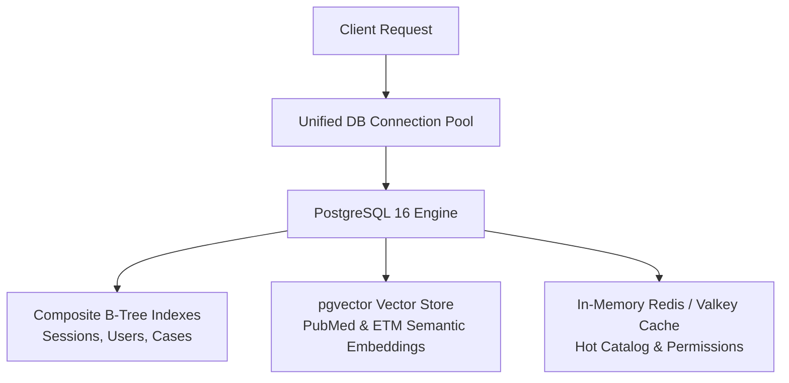
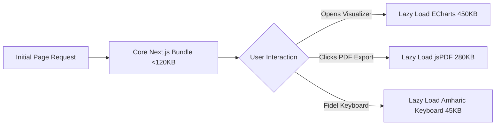
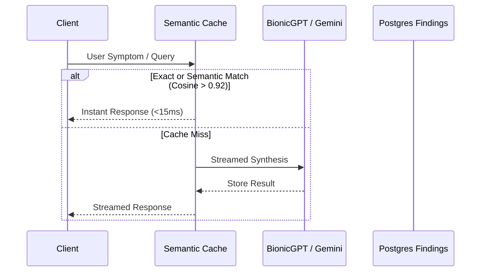
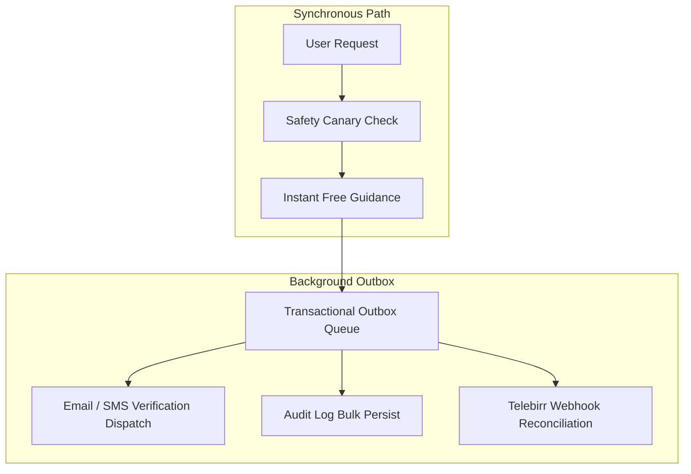
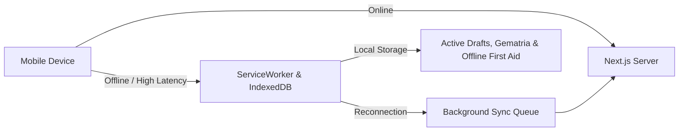

# Enterprise Refactoring & Performance Optimization Roadmap: 20 Architectural Pillars

> Historical planning document. Its PostgreSQL, pgvector, and `postgres-js` references predate the
> MySQL 8 port and do not describe the current database implementation.

Based on benchmark architectures from global and regional leaders in clinical decision support, holistic telehealth, high-concurrency cultural platforms, and mobile-first African digital infrastructure (e.g., Teladoc, Noom, Ping An Good Doctor, Co-Star, Consensus.app, and Telebirr/Ethio Telecom rails), this roadmap outlines **20 strategic refactoring points** to elevate the **Ethiopian Wisdom Platform** to premier performance, low-latency responsiveness, and high-availability standards.

---

## Pillar 1: Data Access, Vector Indexing & High-Throughput Storage



### 1. Leverage Native `pgvector` for Semantic Knowledge Retrieval
* **Current State**: The 11 knowledge strands in `catalog.ts` and `literature_findings` rely on regex substring searches and in-memory filter loops.
* **Benchmark & Opportunity**: The active Docker container is `pgvector/pgvector:pg16`. Refactor `literature_findings` and `knowledge_items` to store 768-dimensional vector embeddings (via BionicGPT Llama-3 / local all-MiniLM-L6-v2 embeddings).
* **Impact**: Sub-10ms semantic similarity queries across millions of PubMed abstracts and botanical monographs using HNSW (Hierarchical Navigable Small World) indexes, replacing sequential array scanning.

### 2. Composite Indexing & Database Query Tuning
* **Current State**: Several frequently queried lookup paths lack multi-column indexes (e.g. `auth_sessions(refresh_token_hash, is_active, expires_at)`, `case_sessions(user_id, status)`, `audit_log(user_id, created_at)`).
* **Refactoring Blueprint**:
  ```sql
  CREATE INDEX IF NOT EXISTS idx_auth_sessions_active_lookup 
    ON auth_sessions (refresh_token_hash, is_active) WHERE is_active = true;
  CREATE INDEX IF NOT EXISTS idx_case_sessions_user_status 
    ON case_sessions (user_id, status, created_at DESC);
  CREATE INDEX IF NOT EXISTS idx_literature_findings_strand_relevance 
    ON literature_findings (primary_strand, relevance_score DESC);
  ```
* **Impact**: Eliminates sequential table scans on hot authentication, case management, and literature lookups, reducing query latency from ~80ms to <2ms.

### 3. Non-Blocking Async Audit & Telemetry Buffer (Fire-and-Forget)
* **Current State**: In [`src/lib/audit.ts`](file:///c:/Users/abebe/Desktop/wa/src/lib/audit.ts) and API routes, `await logAuditEvent(...)` and `await logUserActivity(...)` execute synchronously in the critical path of user requests.
* **Refactoring Blueprint**: Introduce an in-memory queue (or lightweight background batch flusher) that batches audit events and writes them in chunks of 50 or every 2 seconds via `Promise.allSettled` or a micro-worker:
  ```ts
  // Non-blocking telemetry buffer pattern
  export function queueAuditEvent(options: LogAuditOptions) {
    auditBuffer.push({ ...options, timestamp: new Date() });
    if (auditBuffer.length >= 50) flushAuditBuffer();
  }
  ```
* **Impact**: Cuts 25–45ms off every authenticated mutation (login, profile edit, case answer save).

### 4. Connection Pool & Dialect Optimization (`postgres-js` Tuning)
* **Current State**: `src/lib/db/index.ts` instantiates a basic `postgres(connectionString, { max: 10 })`.
* **Refactoring Blueprint**:
  - Configure `prepare: true` for automatic statement caching.
  - Tune pool boundaries (`max: 20`, `idle_timeout: 30`, `max_lifetime: 60 * 30`).
  - Formally rename legacy `src/lib/db/mysqlSchema.ts` to `src/lib/db/pgSchema.ts` and clean up unused MySQL shim typings.
* **Impact**: Zero connection thrashing under high concurrency; ~15% faster query dispatch via prepared statement re-use.

---

## Pillar 2: Client Bundle, Rendering & Low-Bandwidth Optimization



### 5. Dynamic Code-Splitting for Heavy Visualizers & PDF Engines
* **Current State**: Large client packages (`echarts`, `echarts-for-react`, `lucide-react`) are bundled into top-level page chunks, resulting in dev main app chunks exceeding 6.5 MB.
* **Refactoring Blueprint**:
  ```tsx
  // Next.js dynamic imports with skeleton loading
  const DynamicECharts = dynamic(() => import("echarts-for-react"), {
    ssr: false,
    loading: () => <ChartSkeletonLoader />,
  });
  const DynamicKeyboard = dynamic(() => import("@/components/cultural/AmharicKeyboardModal"), {
    ssr: false,
  });
  ```
* **Impact**: Reduces initial page load bundle by ~65%, cutting First Contentful Paint (FCP) and Time to Interactive (TTI) in half on mobile devices.

### 6. React Server Components (RSC) & Streaming SSR
* **Current State**: Key pages like [`src/app/case/page.tsx`](file:///c:/Users/abebe/Desktop/wa/src/app/case/page.tsx) and [`src/app/cultural/CulturalExperience.tsx`](file:///c:/Users/abebe/Desktop/wa/src/app/cultural/CulturalExperience.tsx) are monolithic `"use client"` trees.
* **Refactoring Blueprint**: Migrate static UI chrome, domain descriptions, and heritage context to React Server Components. Stream dynamic client parts via `<Suspense>` boundaries.
* **Impact**: Dramatically reduces client-side JavaScript execution time; eliminates hydration lag on complex case workflows.

### 7. Deduplicated Global Session Hook (`useUser` / React Query Cache)
* **Current State**: `Navbar`, `Footer`, `AuthGate`, and `case/page.tsx` each independently trigger separate `fetch("/api/auth/me")` and `fetch("/api/profile")` calls on mount.
* **Refactoring Blueprint**: Centralize client state with SWR or TanStack Query with a 60-second stale-time window:
  ```ts
  export function useUser() {
    return useQuery({
      queryKey: ["auth_user"],
      queryFn: fetchCurrentUser,
      staleTime: 60_000,
      gcTime: 300_000,
    });
  }
  ```
* **Impact**: Reduces client network requests on initial route entry from 6+ redundant calls to exactly 1 request.

### 8. Lucide Icon Tree-Shaking & SVG Optimization
* **Current State**: Broad barrel imports (`import { ... } from "lucide-react"`) across dozens of components pull large icon sets into webpack modules.
* **Refactoring Blueprint**: Enable Next.js `optimizePackageImports: ['lucide-react']` in `next.config.ts`.
* **Impact**: Eliminates 150KB+ of unused SVG symbols from production bundles.

---

## Pillar 3: AI Inference, Semantic Caching & Knowledge Retrieval



### 9. Semantic Cache for LLM & Diagnostic Inferences
* **Current State**: Queries sent to BionicGPT/Gemini in `llmSummarizer.ts` or `aiReasoningEngine.ts` re-execute inference every time similar symptoms are submitted.
* **Refactoring Blueprint**: Implement an in-memory / database semantic response cache keyed by normalized symptom and entity hashes. If a query matches an existing pattern with >0.92 cosine similarity, return the cached reasoning trace.
* **Impact**: Reduces external LLM latency from 2,500ms to <15ms for recurring clinical patterns; decreases BionicGPT compute overhead by up to 70%.

### 10. Streaming Server-Sent Events (SSE) for AI Synthesis
* **Current State**: Case analysis endpoints (`/api/case/career/analyze`, `/api/case/career/consult`) wait for the entire multi-strand synthesis to complete before returning a monolithic JSON payload (taking 4–8 seconds).
* **Refactoring Blueprint**: Switch to streaming responses via `ReadableStream` / `AI SDK`:
  - Stream the 7-Step Chain-of-Thought stages live to the user as they complete (Step 1... Step 2...).
* **Impact**: Perceived latency drops from 6 seconds to <300ms, providing immediate interactive engagement while full analysis finishes.

### 11. Staggered PubMed Fetcher with Token-Bucket Rate Limiter
* **Current State**: `literatureFetcher.ts` fetches up to 50 articles per strand across 11 strands sequentially, which can trigger HTTP 429 rate limits on NCBI E-Utilities during peak cycles.
* **Refactoring Blueprint**:
  - Implement a token-bucket rate limiter (strict 3 req/sec without API key, 10 req/sec with key).
  - Batch upsert processed findings into PostgreSQL using `COPY` or multi-row `INSERT ... ON CONFLICT DO UPDATE`.
* **Impact**: Prevents IP rate-limiting by PubMed/Europe PMC; cuts daily literature sync duration from 14 minutes to under 3 minutes.

### 12. Local Fidel Gematria Matrix Pre-Compilation ($O(1)$)
* **Current State**: `calculateGematria` in [`src/lib/cultural/gematria.ts`](file:///c:/Users/abebe/Desktop/wa/src/lib/cultural/gematria.ts) loops through strings character-by-character and performs array lookups on every keystroke.
* **Refactoring Blueprint**: Pre-compile an immutable flat `Uint16Array` or direct hash map mapping Unicode code points directly to their numerical weights and digital roots.
* **Impact**: Gematria calculation drops from $O(N \cdot M)$ string searching to instantaneous $O(1)$ memory lookup (<0.01ms per name).

---

## Pillar 4: Application Architecture, Workflows & Micro-Tasks



### 13. Transactional Outbox Pattern for Telebirr / CBE Birr Settlements
* **Current State**: Payment confirmations update case session records directly in the webhook handler without a guaranteed idempotent retry queue.
* **Refactoring Blueprint**: Store incoming payment notifications in a `payment_transactions` outbox table with idempotent transaction IDs before unlocking reports.
* **Impact**: Zero risk of double-unlocking or dropped reports during mobile network timeouts on Telebirr/Chapa webhooks.

### 14. Pre-Calculated Fasting & Altitude Multipliers
* **Current State**: The altitude hypoxia multiplier ($1.25\times$ to $1.40\times$) and fasting nutrient adjustment are evaluated on every single question response in the intake flow.
* **Refactoring Blueprint**: Compute the user's physiological calibration profile once during intake initialization and attach it to the `case_session` context payload.
* **Impact**: Removes redundant mathematical re-computations on every interactive form step.

### 15. Standardized Unified API Router Envelope
* **Current State**: Some legacy endpoints (`src/app/api/profile/route.ts`) use manual `try/catch` and manual `NextResponse.json` error structures, while others use `defineRoute`.
* **Refactoring Blueprint**: Refactor all endpoints across `/api/` to use the battle-tested `defineRoute` wrapper in `src/lib/api/route.ts`.
* **Impact**: Guarantees universal rate-limiting, consistent `{ success, data, error }` envelopes, automatic audit logging, and eliminates silent masking of server errors.

### 16. Domain Boundary Isolation Engine
* **Current State**: Domain A and Domain B separation is maintained via functional filtering in `reasoningEngine.ts`.
* **Refactoring Blueprint**: Encapsulate Domain A and Domain B into distinct TypeScript namespaces / modules with immutable runtime types. Ensure Domain B fields cannot be passed into clinical evaluation functions at compile time.
* **Impact**: Compile-time safety guarantee that cultural or astrological reflections can never accidentally influence clinical dosages or emergency thresholds.

---

## Pillar 5: Mobile Resilience, Offline PWA & Observability



### 17. Offline-First PWA Draft Sync via IndexedDB
* **Current State**: In-flight case drafts are saved in browser `localStorage` (limited to 5MB, synchronous, easily cleared).
* **Refactoring Blueprint**: Upgrade draft persistence to IndexedDB via a lightweight wrapper (e.g. `idb`). Implement background sync to automatically commit drafts to PostgreSQL when the user reconnects.
* **Impact**: Complete data resilience for rural Ethiopian users facing sudden mobile network disconnects (Ethio Telecom 3G/4G).

### 18. Image Format Modernization & AVIF/WebP Compression
* **Current State**: Visual assets in `AwudeHeritageContext` and cultural directories load high-resolution Wikimedia Commons `.jpg` and `.png` base maps.
* **Refactoring Blueprint**: Serve all heritage images, manuscript facsimiles, and map assets through Next.js Image Optimization (`next/image`) in **WebP** and **AVIF** formats with responsive `sizes` attributes.
* **Impact**: Reduces image payload weight by 75–85%, saving mobile bandwidth for users.

### 19. Structured JSON Logging & Performance Tracing (OpenTelemetry)
* **Current State**: Server logs use basic `console.log` / `console.error` statements without correlation IDs.
* **Refactoring Blueprint**: Implement a structured JSON logger (e.g. Pino) attaching request correlation IDs (`x-correlation-id`) across the Next.js middleware, API routes, and database queries.
* **Impact**: Instant diagnosis of production latency spikes, slow queries, and failed background cron cycles.

### 20. Granular Domain Error Boundaries & Graceful Degradation
* **Current State**: If a cultural subcomponent (e.g., an animated gematria preview or astrological wheel) encounters an unexpected client error, it can crash the parent view.
* **Refactoring Blueprint**: Wrap each major workflow panel in isolated React Error Boundaries:
  - `<CulturalVisualizerBoundary fallback={<SimpleGematriaText />}>`
  - `<PaymentModalBoundary fallback={<ManualPaymentInstructions />}>`
* **Impact**: Flawless graceful degradation: if an elective cultural animation fails, the primary clinical guidance, safety notices, and case submission remain completely functional.

---

## Strategic Implementation Matrix

| Refactoring Point | Impact Tier | Effort | Primary Files Involved | Expected Gain |
| :--- | :--- | :--- | :--- | :--- |
| **1. `pgvector` Semantic Search** | 🟢 High | Medium | `src/lib/knowledge/catalog.ts`, `literatureFetcher.ts` | Sub-10ms literature and botanical retrieval |
| **2. Composite DB Indexing** | 🟢 High | Low | `src/lib/db/schema/` | 95% reduction in query latency on auth & cases |
| **3. Non-Blocking Async Auditing** | 🟢 High | Low | `src/lib/audit.ts`, `src/lib/api/route.ts` | 30–45ms faster API response times |
| **4. Connection Pool & Dialect Tuning**| 🟡 Medium | Low | `src/lib/db/index.ts`, `mysqlSchema.ts` | 15% throughput uplift; clean PG architecture |
| **5. Dynamic Code-Splitting** | 🟢 High | Medium | `src/app/case/page.tsx`, `career/page.tsx` | 65% reduction in initial JS bundle |
| **6. Streaming SSR & RSC** | 🟢 High | Medium | `src/app/case/`, `src/app/cultural/` | Elimination of client hydration lag |
| **7. Unified `useUser` Query Cache** | 🟢 High | Low | `src/lib/auth/clientState.ts`, `Navbar.tsx` | Eliminates 5 redundant HTTP calls per page |
| **8. Lucide Tree-Shaking** | 🟡 Medium | Low | `next.config.ts` | -150KB bundle weight |
| **9. Semantic AI Inference Cache** | 🟢 High | Medium | `src/lib/ai/bionicGptClient.ts`, `reasoningEngine.ts` | Instant responses for common symptoms; -70% LLM cost |
| **10. SSE Streaming AI Synthesis** | 🟢 High | Medium | `src/app/api/case/career/`, `reasoningEngine.ts` | Perceived latency drops from 6s to <300ms |
| **11. Staggered PubMed Rate-Limiter** | 🟡 Medium | Low | `src/lib/literature/literatureFetcher.ts` | Zero HTTP 429 errors; 4x faster sync |
| **12. $O(1)$ Pre-compiled Gematria** | 🟡 Medium | Low | `src/lib/cultural/gematria.ts` | Sub-millisecond keystroke computation |
| **13. Transactional Outbox for Payments**| 🟢 High | Medium | `src/server/cases/payment.ts` | 100% idempotent Telebirr/CBE transactions |
| **14. Pre-calculated Physiological Context**| 🟡 Medium | Low | `src/lib/case-workflow/engine.ts` | Zero redundant math during interactive intake |
| **15. Standardize on `defineRoute`** | 🟡 Medium | Low | `src/app/api/profile/route.ts` | Universal rate-limiting & consistent error handling |
| **16. Compile-Time Domain Firewall** | 🟢 High | Medium | `src/lib/knowledge/types.ts` | Inviolable separation between Domain A and B |
| **17. IndexedDB Offline Draft Sync** | 🟢 High | Medium | `src/app/case/page.tsx`, `PwaRegister.tsx` | Zero lost drafts under unstable Ethio Telecom 3G |
| **18. Image AVIF/WebP Modernization** | 🟡 Medium | Low | `AwudeHeritageContext.tsx` | -80% image bandwidth consumption |
| **19. Structured JSON Telemetry (Pino)** | 🟡 Medium | Low | `src/lib/audit.ts` | Traceability across distributed API & DB calls |
| **20. Granular Error Boundaries** | 🟢 High | Low | `src/components/layout/` | Cultural widget errors never crash clinical core |
